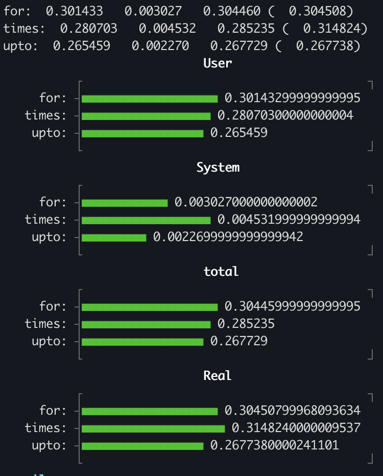

# PlotBenchmark

Being a visual thinker, I prefer charts and diagrams to raw numbers. So I created this project that uses unicode_plot
to generate graph and visualize in the terminal.

```ruby
irb(main):001> n = 5000000
irb(main):002* PlotBenchmark.measure do |x|
irb(main):003*   x.report("for:")   { for i in 1..n; a = "1"; end }
irb(main):004*   x.report("times:") { n.times do   ; a = "1"; end }
irb(main):005*   x.report("upto:")  { 1.upto(n) do ; a = "1"; end }
irb(main):006> end

```




## Installation

Currently in active development. Hence follow the instruction of ##Development

## Development

After checking out the repo, run `bin/setup` to install dependencies. You can also run `bin/console` for an interactive prompt that will allow you to experiment.

To install this gem onto your local machine, run `bundle exec rake install`. To release a new version, update the version number in `version.rb`, and then run `bundle exec rake release`, which will create a git tag for the version, push git commits and the created tag, and push the `.gem` file to [rubygems.org](https://rubygems.org).

## Contributing

Bug reports and pull requests are welcome on GitHub at https://github.com/coderhs/plot_benchmark. This project is intended to be a safe, welcoming space for collaboration, and contributors are expected to adhere to the [code of conduct](https://github.com/[USERNAME]/plot_benchmark/blob/master/CODE_OF_CONDUCT.md).

## License

The gem is available as open source under the terms of the [MIT License](https://opensource.org/licenses/MIT).

## Code of Conduct

Everyone interacting in the PlotBenchmark project's codebases, issue trackers, chat rooms and mailing lists is expected to follow the [code of conduct](https://github.com/[USERNAME]/plot_benchmark/blob/master/CODE_OF_CONDUCT.md).
